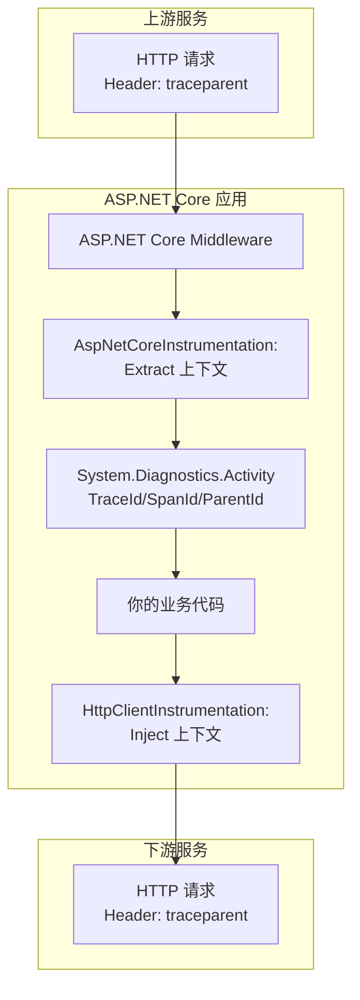

## 疑问

- OTel Collector是什么

```pre
.
├─ docker-compose.yml
├─ otel-collector.yaml
├─ prometheus.yml
├─ grafana-provisioning/
│   ├─ datasources.yaml
│   └─ dashboards/
│       └─ red.json
├─ dapr/
│   ├─ components/
│   │ ├─ pubsub.yaml
│   │ └─ statestore.yaml
│   └─ config/
│       └─ tracing.yaml
└─ apps/
    ├─ gateway/
    │  ├─ Program.cs
    │  ├─ gateway.csproj
    │  └─ Dockerfile
    ├─ ordersvc/
    │  ├─ Program.css
    │  ├─ ordersvc.csproj
    │  └─ Dockerfile
    └─ paymentsvc/
        ├─ Program.cs
        ├─ paymentsvc.csproj
        └─ Dockerfiles
```

## 日志说明

### 字段映射

| 字段          | 来源           | 说明                                  |
| ------------- | -------------- | ------------------------------------- |
| scope.name    | Logger的Source | 对应到.Net Logger的Source，通常是类名 |
| severity_text | Level          | Information、Warn、Error等            |

## 请求链路


